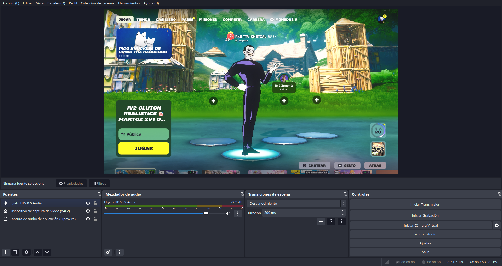

# HD60 S Linux Driver

Driver en espacio de usuario para la tarjeta de captura HDMI **Elgato HD60 S** en Linux.

No hay driver oficial fuera de Windows y macOS. Este proyecto habla el protocolo USB del aparato, saca vídeo 1080p60 y audio, y deja el HDMI passthrough hacia el televisor para jugar con poca latencia.

Dispositivo soportado: **VID `0fd9` / PID `005e`**. No es el HD60 S+ ni el HD60 X.



*Salida de `iso_capture` en `/dev/video42` (1080p60 YUYV).*

## Qué hace

Un `./scripts/hd60s live` deja listo:

- Vídeo **1080p60 YUYV** en `/dev/video42` (v4l2loopback), usable desde OBS, mpv o ffmpeg.
- Audio **48 kHz estéreo** (PCM HDMI nativo) por PipeWire nativo `hd60s_capture`. Alternativa: loopback ALSA (`hw:10,0` → `hw:10,1`).
- **Passthrough HDMI** (HDMI OUT del HD60 S → TV) a la vez que la captura USB.
- Reintento automático si se desconecta el USB (`scripts/run-hd60s-obs.sh`).

Comprobado con Nintendo Switch.

## Qué no es

- **HD60 S+** y **HD60 X**: otro chipset. No arrancan con este código.
- Un módulo del kernel. Todo corre en userspace con libusb.
- Un comando `hd60s prep`. `prep` es una función interna de `scripts/hd60s-lib.sh`; los módulos se cargan al usar `live`, `obs` o `start`.
- `color-test`: se está retirando y no forma parte del flujo actual.

## Requisitos

- **USB 3.0 (SuperSpeed)**. 1080p60 pide ~2 Gbps; USB 2.0 no alcanza.
- **PipeWire** (no PulseAudio a secas).
- **v4l2loopback** en `/dev/video42` (`video_nr=42`, `exclusive_caps=0`).
- **snd-aloop** en `index=10` (`id=hd60s`).
- Ubuntu 25.04 o similar (kernel 7.0, PipeWire 1.6+). Otras distros no están verificadas.
- Elgato HD60 S en el bus: `0fd9:005e`.

## Estructura

```
src/iso_capture.c          captura (orquesta los módulos)
src/util/                  hd60s_util
src/v4l2/                  hd60s_v4l2
src/audio/                 hd60s_audio
src/replay/                hd60s_replay + includes de audio ISO
src/pace/                  hd60s_pace
src/parser/                hd60s_parser
src/usb/                   hd60s_usb
tools/                     audio_extract, offline_parser, spi_dump, probe_iso
analysis/                  TSV de init/burst
                           (live usa init-p2-audio-fast.tsv y poststream-no9a.tsv)
scripts/hd60s              lanzador
scripts/hd60s-lib.sh       helpers (módulos, USB, doctor)
scripts/run-hd60s-obs.sh   supervisor: espera el USB y relanza iso_capture
packaging/                 udev, unit systemd, regla WirePlumber
docs/                      screenshot.png
Makefile
```

Los binarios (`iso_capture` y las tools) se generan en la raíz del repo. El lanzador vive en `scripts/`; resuelve la raíz del checkout solo.

## Compilar

Desde la raíz del repo:

```bash
./scripts/hd60s install-deps
make all
./scripts/hd60s doctor
```

`install-deps` instala compilador, libusb, ALSA, PipeWire, libsamplerate, v4l2loopback, headers del kernel, tmux, mpv, VLC, ffmpeg y OBS.

`make all` construye `iso_capture` (enlace de `src/iso_capture.c` y los módulos bajo `src/*/`) y las tools. Hace falta `libsamplerate`. `live` también usa `alsa-utils` (`arecord` / `aplay`).

Instalación opcional a `/usr/local` (regla udev `packaging/70-elgato-hd60s.rules`, WirePlumber en `packaging/wireplumber/`, unit `packaging/hd60s.service.in`, `hd60s` en `PATH`):

```bash
sudo make install
systemctl --user daemon-reload
systemctl --user enable --now hd60s
```

Tras instalar, el comando es `hd60s`. El loopback queda en `/dev/video42` como **ElgatoHD60S** (`exclusive_caps=1`) para que OBS lo vea como cámara. El servicio de usuario arranca `iso_capture` al iniciar sesión y al enchufar el USB. Quitar: `systemctl --user disable --now hd60s` y `sudo make uninstall`.

## Uso

Desde la raíz del repo, con `iso_capture` ya compilado en esa raíz:

```text
./scripts/hd60s live           tmux: supervisor arriba, mpv en /dev/video42 a los 13 s
./scripts/hd60s obs            arranca la captura y abre OBS
./scripts/hd60s start [seg]    iso_capture en primer plano (600 s por defecto)
./scripts/hd60s view           VLC con vídeo y audio
./scripts/hd60s stop           mata iso_capture y la sesión tmux
./scripts/hd60s doctor         comprueba dependencias, módulos y el USB
```

```bash
./scripts/hd60s live
```

En tmux, panel de arriba: `scripts/run-hd60s-obs.sh` (init `analysis/init-p2-audio-fast.tsv`, burst `analysis/poststream-no9a.tsv`, `HD60S_AUDIO_PW=0`). Panel de abajo: mpv con `--vo=wlshm`. Sin preview: `HD60S_NO_MPV=1 ./scripts/hd60s live`.

- Cambiar de panel: `Ctrl+B` y flechas
- Detach: `Ctrl+B`, `d`
- Salir del todo: `Ctrl+B`, `q`, o `./scripts/hd60s stop`

### OBS

1. `HD60S_NO_MPV=1 ./scripts/hd60s live` (o `./scripts/hd60s obs`).
2. Fuentes:
   - vídeo V4L2: dispositivo **ElgatoHD60S** (`/dev/video42`), 1920×1080, 60 fps, YUYV.
   - audio: PipeWire-Pulse `hd60s_capture` (48 kHz estéreo).

`sudo make install` y `systemctl --user enable --now hd60s` dejan el loopback con `exclusive_caps=1` (OBS lo ve como cámara nativa) y arrancan la captura al enchufar el USB.

### Audio

Por defecto el audio no sale por PipeWire nativo de `iso_capture`. Escribe en snd-aloop y `scripts/run-hd60s-obs.sh` publica `hd60s_capture` con `pactl` (`HD60S_AUDIO_PW=0` en `live`).

PipeWire nativo: `HD60S_AUDIO_PW=1`. En ese modo no se publica la fuente ALSA.

`./scripts/hd60s help` lista comandos de laboratorio (`test`, `minimal`, `view-mpv`, etc.). `pt` / `ptx` están marcados como rotos: no usarlos.

## Limitaciones

- 1080p60 YUYV sin comprimir (~2 Gbps). `iso_capture` y OBS usan CPU de verdad; no es un fallo del driver.
- Solo 1080p60. No hay 720p ni 30 fps.
- El loopback tiene que ir con `exclusive_caps=1`. Con 0, OBS 30 puede abortar en `linux-v4l2.so`.
- Wayland + NVIDIA: mpv con `--vo=gpu-next` puede fallar; `live` fuerza `--vo=wlshm`.
- No hay hotplug por libusb. El supervisor hace polling hasta que el USB vuelve a enumerar.
- Implementación no oficial, sin relación con Elgato Systems GmbH. Uso bajo tu responsabilidad.

## Licencia

[MIT](LICENSE). Copyright (c) 2026 kusq.
